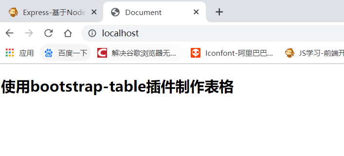

## Express框架

> **Express** 基于  NodeJS  平台，快速、开放、极简的Web开发框架
>
> 它**主要的目的就是使用NodeJS快速的创建Web服务器**

------

### Express页面渲染

>  之前(上一篇文章)我们导入了Express框架，并通过express()程序监听服务器端口来处理前端的GET请求。

```javascript
const express = require("express");//导入express框架
const app=express();//执行express(),app就是项目程序
```

> 用到了  `resp.send()`  ，它只是服务器向浏览器显示文本。如果我们想从服务器向浏览器发送一个html页面并显示在前端，就需要借助第三方模块，如     `ejs ` ,  `jade`   或目前比较流行的  `art-template`

---

> 首先，我们要在当前项目下新建一个文件夹    `views`  ，这个文件夹只存放视图   `html`   文件。
>
> Express框架如果要与art-template结合，则需要安装下面两个包

```
$ npm install art-template express-art-template --save
```

#### 第一步：设置视图文件的所在位置

```javascript
const path=require("path");//导入用来配文件路径的模块path
app.set("views",path.join(__dirname,"./views"));设置视图文件的所在位置
//path.join()不是单纯的拼接路径字符串，而是拼接路径(__dirname当前文件夹的绝对路径 + 当前文件夹下的要设置的文件夹)
```

#### 第二步：设置模板渲染引擎

> 因为express自己没有模板渲染引擎，所以要借助第三方模块

```javascript
const template=require("express-art-template");//导入模板引擎
app.set("view engine","html");//设置程序的视图引擎为html
app.engine("html",template);//告诉程序，模板引擎处理的视图文件后缀名是html
```

> 设置完成以后，需要使用   **`resp.render()`**   方法向浏览器传递并渲染一个模板文件

```javascript
app.get("/",(req,resp)=>{
    // resp.render("app.html");
    resp.render("app");//因为配置了视图文件后缀名为html，故.html可省略
});
```

> 监听80端口

```javascript
app.listen("80",()=>{//监听80端口，http默认端口80
    console.log("服务器已启动");
})
```

> 启动服务器(本js文件(一般取名app.js))

```
$ node app.js
```

