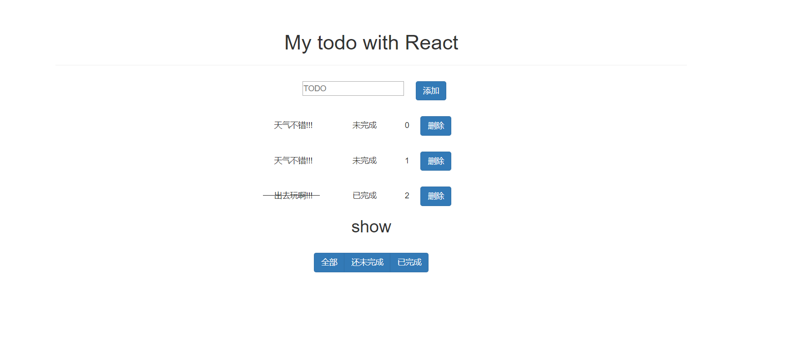
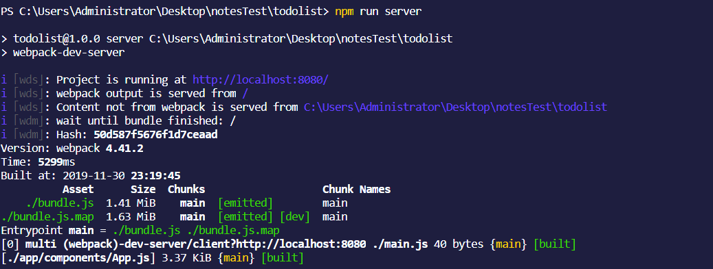

##      使用React完成第一个项目-新手todolist记事本(一)

> 之前学习的企业级react应用框架UmiJS在我的第一个react项目中并没有使用。



### 项目的目录结构

```javascript
.
|-app												//开发的文件夹，组件放在这个文件夹中
|	|-components									//项目的组件
|   |	|-App.js									//最外层包含下面组件的总组件
|   |	|-AppFooter.js								//App的三个筛选按钮的组件
|   |	|-AppForm.js								//添加list的form
|	|	|-AppList.js								//显示list的智能组件
|	|	|-AppTodos.js								//显示list的木偶组件
|-css												//放css文件的地方
|	|-semantic.css									//我们的文件用到了semantic.css
|-node_modules										//第三方的依赖
|-.babelrc											//babel配置文件
|-.gitignore										//git上传时忽略的文件
|-dist												//webpack build之后的文件夹
|	|-bundle.js										//webpack build之后的文件
|-index.html										//项目的模板文件
|-main.js											//项目的入口文件
|-webpack.config.js									//webpack的配置文件
|-package.json										//当前整个项目的依赖
```

### 安装依赖，配置环境

> 新建一个todolist文件夹，根据目录结构建好相应的文件。

```sh
$ mkdir todolist
$ cd todolist
```

> 建立   `package.json`   文件(初始化项目)

```sh
$ npm init --yes
```

> 安装相应的依赖，首先安装Babel，Babel是一个JavaScript编辑器，它可以将es6或者es7的语法转化为浏览器能识别的JavaScript。

```sh
npm install babel-cli babel-core --save-dev
```

> 其次安装我们的主角  `react`

```sh
npm install react react-dom --save-dev
```

> 安装  `webpack`   打包工具 和   `webpack-dev-server`   ，用于来给我们开启一个服务的。

```s
npm install webpack webpack-dev-server --save-dev
```

> 安装   `loader`  打包，通过使用不同的   `loader`  ，  `webpack`  有能力调用外部的脚本或工具，实现对不同格式的文件的处理，比如说分析转换scss为，或者把下一代的JS文件(ES6,ES7)转换为现代浏览器兼容的JS文件，对React的开发而言，合适的Loaders可以把React中用到的<font color="blueviolet"> JSX文件</font>转换为JS文件。

```sh
npm install css-loader babel-loader style-loader --save-dev
```

然后我们在  `webpack.config.js`  中引用这些依赖。**注：**<font color="violet">webpack虽然好用，但是webpack版本不向上兼容，所以配置webpack.config.js配置文件时,可以参考 [webpack中文文档](https://www.webpackjs.com/guides/installation/)</font>

```js
module.exports = {
  entry: './main.js',                 // webpack打包的入口文件
  output: {
    filename: './bundle.js'           // 输出之后的文件名
  },
  module: {
    rules: [    //webpack 3版本是loaders
      {
        test: /\.jsx?$/,
        exclude: /node_modules/,
        loader: 'babel-loader'         // babel的loader，jsx文件使用babel-loader处理
      }, {
        test: /\.css$/,
        exclude: /node_modules/,
        loader: 'style!css'              // css和styleloader，对css后缀的文件进行处理
      }
    ]
  },
  devtool: 'cheap-source-map',
  mode: 'development'		  //开发者模式。这个配置是因为我在webpack build时报错然后加上去就运行正常
}
```

> 同时要让我们的  `babel`  能在  `react`  中生效，同时支持es6/es7，我们需要安装下面的插件

```sh
npm install babel-preset-es2015 babel-preset-react babel-preset-stage-0 --save-dev
```

> 安装完依赖以后，我们在  `.babelrc`  文件中引入这几个依赖

```js
{
  "presets": ["es2015","react",'stage-0']
}
```

> 其次为了当我们每次添加list的时候有一个唯一的id，我们使用uuid

```sh
npm install uuid --save-dev
```

在package.json配置scripts项目构建及服务启动的快捷方式

```js
 "scripts": {
    "test": "echo \"Error: no test specified\" && exit 1",
    "build": "webpack",
    "server":"webpack-dev-server"
  },
```

> **提醒：**<font color="##F5C909">如果在构建项目或是启动服务时报错，则按照报错提示一步一步查错即可</font>

### 组件的编写，使我们的页面能够显示出来

#### 编写模板文件  `index.html`

在这个模板文件里面，我们引入了  `semantic.css`  文件，然后建立了一个  `id=app`  的  `<div>`  为了我们后续的  `react`  操作。

```html
<!DOCTYPE html>
<html lang="en">

<head>
    <meta charset="UTF-8">
    <meta name="viewport" content="width=device-width, initial-scale=1.0">
    <meta http-equiv="X-UA-Compatible" content="ie=edge">
    <title>Document</title>
    <link rel="stylesheet" href="/css/semantic.css">
    <link rel="stylesheet" href="/node_modules/bootstrap-3.3.7-dist/css/bootstrap.min.css">
    <style>
        .active {
            color: red;
        }

        .line {
            display: inline-block;
            border-bottom: 1px solid #222222;
            width: 100px;
            position: absolute;
            left: 0;
            top: 7px;
        }

        .ui,.comments,.comment {
            padding: 0;
            margin: 2em 0 0;
        }
    </style>
</head>
<body>
    <div class=" container" style="padding: 30px;text-align: center">
        <div id="app"></div>
    </div>
</body>
<script src="/bundle.js"></script>

</html>
```

#### 编写入口文件  `main.js`

这边的  `data`  是我们的模拟数据，将其传入到  `<App/>`  组件，在子组件中可以通过  **`props.data`**  的方法获取  `data` 。

```jsx
import React from "react"
import ReactDOM from "react-dom"

import App from "./app/components/App"

let data =[
    {id:0,text:'天气不错!!!',complete:false},
    {id:1,text:'天气不错!!!',complete:false},
    {id:2,text:'出去玩啊!!!',complete:true},
]

ReactDOM.render(
    <App data={data}/>,
    document.getElementById('app')
)
```

#### 编写  `component`  里面的组件

##### App.js

这个组件我们可以认为是一个容器组件，我们会把  `AppForm`  、`AppList` 、 `AppFooter`  放在这个组件中。

```jsx
import React from "react"
import AppList from "./AppList.js"
import AppForm from "./AppForm.js"
import AppFooter from "./AppFooter.js" 


class App extends React.Component{
    state ={
        choosevalue:1,
        data:this.props.data
    }

    render(){
        const {data}=this.state;
        return (
            <div className="ui comments">
                <h1>My todo with React</h1>
                <hr/>
                <AppForm/>
                <AppList data={data}/>
                <AppFooter/>
            </div>
        )
    }
}

export default App; 
```

> **题外话：import…from、require()、export default、export、module.export的区别。**
>
> ​	<font color="#72E5EE">import…from 导入某个模块、export default/export 导出某个模块，他们属于**ES6规范**。至于export default与export的区别就是export default表示当前文件唯一导出模块。</font><font color="#007EC6">require()导入模块、module.export/export导出模块属于**CommonJS规范**。至于module.export与export的区别在于export只是module.export的引用。</font>

##### AppForm.js

这个组件是我们添加  `list`  用的一个 `form` 组件，其中下面的  `styles` 这个对象也是 `jsx` 中申明样式的一种方式，另外， `jsx`  中使用  `className`  来添加样式名字。

```jsx
import React from 'react';
import uuid from 'uuid';

var styles = {
  'title': {
    width: 200,
    display: 'inline-block',
    marginRight: 10,
    verticalAlign: 'top'
  }
}

class AppForm extends React.Component {
  render () {
    return (
      <form className='ui reply form'>  {/* React项目里 是JSX语法，样式用className而不是js中的class */}
        <div className='field input-md' style={styles.title}>
          <input type='text' placeholder='TODO' ref='text' />
        </div>

        <button type='submit' className='btn btn-primary'>
            添加
        </button>
      </form>
    )
  }
}

export default AppForm;
```

##### AppList.js

这个组件是我们在  `react`  中常说的<font color="deeppink">智能组件</font>，得到数据  `data`  后通过  `map`  方法遍历数据，然后进行渲染。这里的  `map`  方法使用到了 es6中的解构赋值。

```jsx
import React from 'react'
import AppTodos from './AppTodos'

class AppList extends React.Component {
  render () { 
    const a = this.props.data.map(({ id, text, complete }, index) => {
       return  (
           <AppTodos 
               key={index} 
               id={id} 
               text={text} 
               complete={complete} 
             />)
    })

    return (
      <div> { a } </div>
    )
  }
}

export default AppList;
```

##### AppTodo.js

这个组件是我们在 `react`  中常说的<font color="deep">木偶组件</font>,就是得到数据渲染组件。

```jsx
import React from 'react'

var styles = {
  'title': {
    paddingLeft: '20px',
    paddingRight: '50px',
    position: 'relative'
  },
  'delete': {
    marginLeft: '20px',
    marginRight: '50px'
  }
}

class AppTodos extends React.Component {
  render () {
    return (
      <div className='comment'>
        <div className='content'>
          <span 
               className='author' 
                style={styles.title} 
          >
              {this.props.text}
            <span 
                    className={this.props.complete ? 'line' : ''} 
            />
          </span>
          <span className='author' 
                style={styles.title}>
                {this.props.complete ? '已完成' : '未完成'}
          </span>
          <span className='author'>{this.props.id}</span>
          <span className='btn btn-primary' 
                style={styles.delete} >
                删除
          </span>  
        </div>
      </div>
    )
  }
}

export default AppTodos;
```

##### AppFooter.js

这个组件就是<font color="deeppurple">底部</font>的三个按钮。

```jsx
import React from "react";

var styles = {
  title: {
    marginRight: 10,
    fontSize: 20
  },

  top: {
    marginTop: 20
  }
};

class AppFooter extends React.Component {
  render() {
    return (
      <div>
        <h2 style={styles.top}>show</h2>
        <div className="btn-group">
          <button
            type="submit"
            style={styles.top}
            className="btn btn-primary"
            value="1"
            ref="all"
          >
            全部
          </button>
          <button
            type="submit"
            style={styles.top}
            className="btn btn-primary"
            value="2"
            ref="active"
          >
            还未完成
          </button>
          <button
            type="submit"
            style={styles.top}
            className="btn btn-primary"
            value="3"
            ref="complete"
          >
            已完成
          </button>
        </div>
      </div>
    );
  }
}

export default AppFooter;
```

> 然后我们在命令行输入，开启服务。访问  `http://localhost:8080/`  就可以看到本项目基本框架。

```sh
$ npm run server
```



> 插曲：作者用的编辑器是VSCode，本身不支持jsx语法，所以在写react项目时会很多报错。同样使用VSCode的小伙伴可以下载一个 Sublime Babel 插件和一个 JS JSX Snippets插件。如果还是报错的解决办法：文件--首选项--设置--用户设置 搜索 includeLanguages
>
> 在用户设置添加
>
> "emmet.includeLanguages": {
>
> ​         "javascript": "javascriptreact"
>
> }