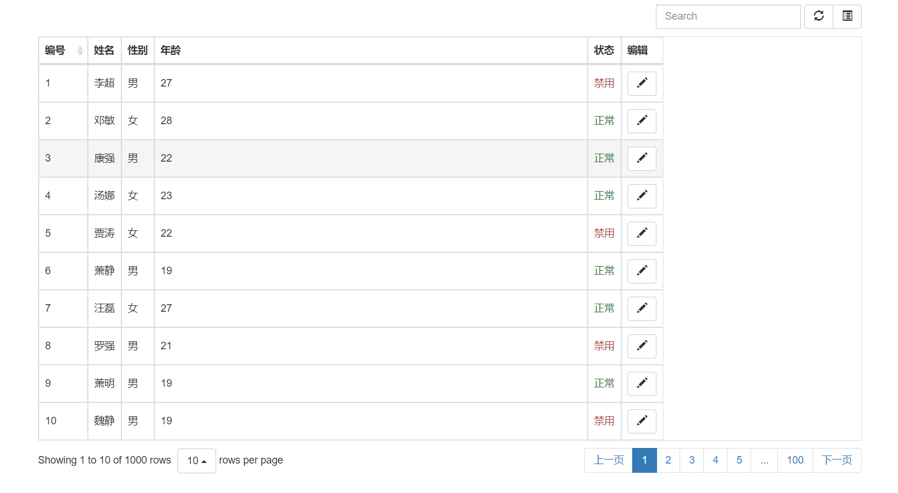

## BootstrapTable-表格组件神器

> bootstrapTable有两种使用方法，一是通过自定义属性`data-`去触发插件的各功能(如data-field匹配各列数据)，所以这个开始就写好了表头`<thead>` ，数据就需要完全匹配上，没有我们常用的第二种通过js使用插件的方法随意便捷。我们今天就来讲解第二种方法来使用bootstrapTable插件。

#### 首先，导入css文件

```html
    <link rel="stylesheet" href="./bootstrap.css">
    <link rel="stylesheet" href="./bootstrap-table.min.css">
```

#### 再导入js文件，我们使用mockjs来提供虚拟数据

```html
<script src="./jquery.min.js"></script>
<script src="./node_modules/mockjs/dist/mock.js"></script>
<script src="./bootstrap.min.js"></script>
<script src="./bootstrap-table.min.js"></script>
```

#### 本方法只需在页面写一个id为xxx的标签

```html
<div id="bootstrapTable"></div>
```

#### 用js将数据转为表格渲染到标签里

##### 使用mockjs生成虚拟数据

```js
    Mock.mock('url', { //mockJS的语法 key|count:value
        "userInfo|1000": [{
            "id|+1": 1,//表示id从1开始递增
            "name|1":"@cname",//特殊符号表示中文名
            "sex|1":['男','女'],//表示从后面的数组随机取值
            "age|18-35":26,//年龄从18-35的随机数
        }]
    });
```

##### 获取到虚拟数据，使用bootstrapTable插件渲染到页面

`$(“#xxx”).bootstrapTable({})`

```js
$.get('url', function (data) {
        $('#bootstrapTable').bootstrapTable({
            url: "", //请求地址
            data:JSON.parse(data).userInfo,//拿到数据
            showRefresh: true,//是否显示刷新按钮
            smartDisplay: true,//默认为true，会 机智地 根据情况显示分页（pagination）或卡片视图（card view）
            showToggle: true,//默认为false隐藏视图切换按钮，设为true显示
            paginationPreText: '上一页',//默认 ‹
            paginationNextText: '下一页',//默认 ›
            pagination: true, //分页
            pageNumber: 1,//默认第1页，用于设置初始的页数 前提：pagination设为true，启用了分页功能。
            pageSize: 15,//用于设置每页初始显示的条数 前提：pagination设为true，启用了分页功能。
            pageList: [10, 20, 30, 50, 'all'], //分页步进值
            search: true, //显示搜索框
            columns: [{
                    field: 'id', //要与数据key一一对应
                    title: '编号',//表头名
                    sortable:true//本列可排序 显示排序按钮
                },
                {
                    field: 'name',
                    title: '姓名',
                },
                {
                    field: 'sex',
                    title: '性别',
                },
                {
                    field: 'age',
                    title: '年龄',
                    width: '600px' // 宽度
                },
                {
                    field: 'status',
                    title: '状态',
                    formatter: function (value, row, index) { // 单元格格式化函数 可自定义方法返回数据显示在表格中
                        if (value == 1) {
                            return "<span class='text-success'>正常</span>"
                        }
                        return "<span class='text-danger'>禁用</span>"
                    }
                },
                {
                    title: '编辑',
                    formatter: function (value, row, index) { // 单元格格式化函数
                        var id = row['id'];
                        var str = '<div class="btn-group"> ' +
                            ' <button class="btn btn-default btn-edit" title="详情"' +
                            'data-toggle="tooltip" data-placement="left" data-value="' 								+ id +   
                            '" >  ' +
                            '  <i class="glyphicon glyphicon-pencil"></i>  ' +
                            ' </button>  ' +
                            ' </div>  ';
                        return str;
                    }
                },
            ]
        })
    })
```



