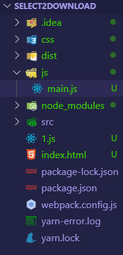
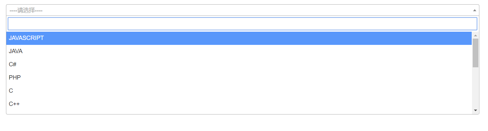

## select2下拉框插件调用nodeJS写的api接口并使用webpack打包。简单的实现前后端分离

> Select2是一款**基于JQuery**的下拉列表插件，主要用来优化select，支持单选和多选，同时也支持分组显示、列表检索、远程获取数据等众多好用的功能。

### 新建后端文件夹，NodeJS编写api接口

> ps:不想用MockJS弄假数据了 ,所以自己用NodeJS写了个接口从数据库拿数据给前端。

<font color="violet">nodeJS用express框架写服务器后端之前博客有写，在此一笔带过。</font>

<font color="blueviolet">`新建文件夹` -> `$ npm init --yes` -> `$ npm install express mysql --save`</font>

**app.js**

```js
const express = require("express"); //导入express框架
const app = express(); //项目程序app
const mysql = require("mysql"); //导入mysql

app.all("*",(req,resp,next)=>{//设置跨域访问
    resp.header("Access-Control-Allow-Origin","*");//通过设置响应头 允许跨域
    resp.header("Access-Control-Allow-Headers","X-Requested-With");
    resp.header("Access-Control-Allow-Methods","PUT,POST,GET,DELETE,OPTIONS");
    resp.header("X-Powered-By","3.2.1");
    resp.header("Content-Type","application/json;charset=utf-8");
    next();
});//  哇！大坑，看了半天，还以为自己跨域设错了。 注：跨域响应头必须设在项目启动最前面

let select2Manage = mysql.createConnection({
  // 创建数据库连接
  host: "47.240.xx.xxx",
  port: 3306,
  user: "stuxxx",
  password: "LxHxxxxxxxx",
  database: "stuxxx",
  multipleStatements: true //开启多条sql语句查询
});
select2Manage.connect(); //连接数据库

app.get("/getSelect2List", (req, resp) => {
  let strSql = `SELECT * FROM stuTest.comLanguages`; //编写sql语句
  select2Manage.query(strSql, (err, result) => {//数据库查询
        resp.send(result);//返回的是查询到的 以一个数组拿出
  });
});

app.listen("9000", () => {
  console.log("服务器已开启");
});
```

> <font color="deeppink">踩到的坑：服务器后端**设置响应头**解决跨域问题时必须**设置在项目启动的前面**</font>

### 新建前端文件夹使用select2插件，配置webpack以便后续打包

> 先安装webpack `npm install --save-dev webpack` ，再参考 [webpack中文网](https://www.webpackjs.com/configuration/) 配置`webpack.config.js` 配置文件

```js
let path = require("path");
var htmlWebpackPlugin = require('html-webpack-plugin');
var webpack = require('webpack');
module.exports = {
    entry: './js/main.js',                 // webpack打包的入口文件  要打包的文件
    output: {
        filename: './bundle.js'           // 输出之后的文件名
    },
    module: {
        rules: [    //webpack 3版本是loaders
            {
                test: /\.(jsx|js)?$/,
                exclude: /node_modules/,
                loader: 'babel-loader'         // babel的loader，jsx文件使用babel-loader处理
            },
            {test: /\.css$/, loader: "style-loader!css-loader"},
            {test: /\.eot(\?v=\d+\.\d+\.\d+)?$/, loader: "file-loader"},
            {test: /\.(woff|woff2)$/, loader: "url-loader?prefix=font/&limit=5000"},
            {test: /\.ttf(\?v=\d+\.\d+\.\d+)?$/, loader: "url-loader?limit=10000&mimetype=application/octet-stream"},
            {test: /\.svg(\?v=\d+\.\d+\.\d+)?$/, loader: "url-loader?limit=10000&mimetype=image/svg+xml"}
        ]
    },
    devtool: 'cheap-source-map',
    mode: 'development',
    devServer: {
        contentBase: path.join(__dirname, "dist"),
        compress: true,
        port: 9002
    },
    plugins: [
        new htmlWebpackPlugin({
            title: "this is title", //用于生成的HTML文档的标题。
            filename: "index.html", // 生成的模板文件的名字 默认index.html
            template: "index.html", //模板来源文件
            inject: false, //注入位置'head','body',true,false
            favicon: "", //指定页面图标
            minify: {
                caseSensitive: false, ////是否大小写敏感
                collapseBooleanAttributes: true, //是否简写boolean格式的属性如：disabled="disabled" 简写为disabled
                collapseWhitespace: true //是否去除空格
            },
            hash: true, //是否生成hash添加在引入文件地址的末尾，类似于我们常用的时间戳，这个可以避免缓存带来的麻烦
            cache: true, //是否需要缓存，如果填写true，则文件只有在改变时才会重新生成
            showErrors: true, //是否将错误信息写在页面里，默认true，出现错误信息则会包裹在一个pre标签内添加到页面上
            chunks: ['a', 'b'], //引入的a,b模块，这里指定的是entry中设置多个js时，在这里指定引入的js，如果不设置则默认全部引入,数组形式传入
            chunksSortMode: "auto", //引入模块的排序方式
            excludeChunks: ['a', 'b'], //排除的模块,引入的除a,b模块以外的模块，与chunks相反
            xhtml: false //生成的模板文档中标签是否自动关闭，针对xhtml的语法，会要求标签都关闭，默认false
        }),
        new webpack.ProvidePlugin({//通过插件来配置全局jquery
            $: "jquery",
            jQuery: "jquery",
            "windows.jQuery": "jquery"
        })
    ]
}
```

**注：webpack打包项目里不要用根目录(/)、绝对路径。<font color="deepyellow">最好用相对路径(./)</font>**

> 再安装需要的依赖包，本项目主角是select2模块，依赖于jquery

配置`package.json`，方便项目使用webpack打包以及启动服务。部分代码:

```json
  "scripts": {
    "test": "echo \"Error: no test specified\" && exit 1",
    "build": "webpack",
    "start": "webpack-dev-server --open"
  },
```

**index.html模板html文件**

```html
<!DOCTYPE html>
<html lang="en">
<head>
    <meta charset="UTF-8">
    <title>Title</title>
</head>
<body>
<div class="container" style="margin-top: 20px">
    <div class="form-group">
        <select id="select2_demo" class="form-control "><!-- 添加 multiple="multiple" 属性即为下拉框多选 -->
            <option value="">---请选择---</option>
        </select>
    </div>
</div>
</body>
<script src="bundle.js"></script>
</html>
```

> webpack打包输出的bundle.js，里面包含打包的css,js等文件，只需把它导入html即可

**main.js入口js文件**

```js
/**
 * Created by catchWind on 2019/12/9.
 */
import "../css/main.css"
/* 导入自己写的css文件，不要用根目录"/" 用相对路径'./'or'../'*/
import "../node_modules/bootstrap/dist/js/bootstrap"
import "../node_modules/bootstrap/dist/css/bootstrap.css"
import "../node_modules/select2/dist/js/select2"
import "../node_modules/select2/dist/css/select2.css"

$("#select2_demo").select2(
    {
        placeholder: "----请选择----",
        // minimumInputLength: 1,
        ajax: {
            delay: 250, /*配置告诉select2在用户停止输入多少毫秒后开始查询，合理设置可以避免频繁向后端发送请求*/
            url: "http://localhost:9000/getSelect2List",
            dataType: "json",/* dataType的选值很重要 需要能够接收后端返回类型 */
            method: 'GET',
            data: function (params) {//下拉框搜索栏的搜索参数
                return {
                    search: params.term,
                };
            },
            processResults: function (data) {//请求结果
                var list=[];
                data.map(item => {
                    return item.computerLanguages;
                }).forEach((item,index)=>{
                    list.push({"id":index,"text":item})
                });
                return {results: list}
            },
            cache: true
        }
    }
);
```

> **<font color="lightblue">前端jquery的ajax请求的小坑：</font><font color="blue">dataType的选值需要能够接收后端返回的数据类型</font>，不然就会进入error分支**

### webpack打包并启动服务

> 根据`package.json`配置的webpack快捷启动

```sh
$ npm run build     //webpack打包
$ npm start         //启动服务
```


**前端文件结构如下：**



### 最后启动后端api

```sh
$ node app.js
```

访问如下图：



