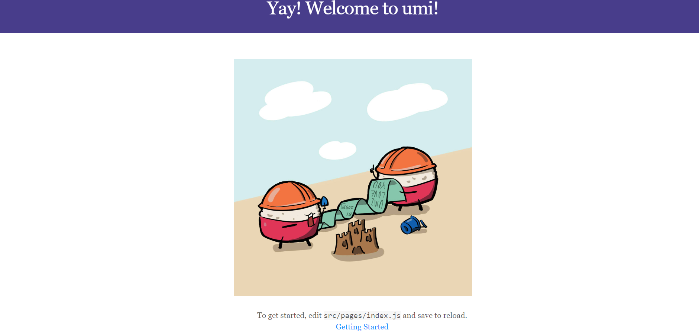

##UmiJS-可插拔的企业级react应用框架，快速上手，通过脚手架创建项目以及上线部署umi项目

> umi，中文可发音为乌米，是**一个可插拔的企业级react应用框架**。umi以路由为基础的，支持类next.js的约定式路由，以及各种进阶的路由功能，并以此进行功能扩展，比如支持路由级的按需加载。然后配以完善的插件体系，覆盖从源码到构建产物的每个生命周期，支持各种功能扩展和业务需求，目前内外部加起来已有50+的插件。

> umi是蚂蚁金服的底层前端框架，已直接或间接地服务了600+应用，包括Java、node、H5无线、离线(Hybrid)应用、纯前端assets应用、CMS应用等。他已经很好地服务了我们的内部用户，同时希望他能服务好外部用户。

### 创建umi项目

> umi通过create-umi提供脚手架能力

首先，在新目录下使用    `yarn create umi`    ，

```sh
$ mkdir myapp
$ cd myapp 
$ yarn create umi
```

选择project,

```sh
? Select the boilerplate type (Use arrow keys)
  ant-design-pro  - Create project with an layout-only ant-design-pro boilerplate, use together with umi block.
❯ app             - Create project with a simple boilerplate, support typescript.
  block           - Create a umi block.
  library         - Create a library with umi.
  plugin          - Create a umi plugin.
```

选择是否使用 TypeScript，

```sh
? Do you want to use typescript? (y/N)
```

然后，选择需要的功能，

```sh
? What functionality do you want to enable? (Press <space> to select, <a> to toggle all, <i> to invert selection)
❯◯ antd
 ◯ dva
 ◯ code splitting
 ◯ dll
```

确定后，会根据你的选择自动创建好目录与文件，然后开始安装依赖，

```sh
$ yarn
```

最后通过  `yarn start`   启动本地开发(http://localhost:8000)

```sh
$ yarn start
```



---

### umi项目的部署发布

####  构建

执行  `umi build`  ,

```sh
$ umi build
```

> 构造的产物默认生成到  `./dist`   下

#### 本地验证

发布之前，可以通过  `serve`  做本地验证,

```sh
$ yarn global add serve
$ serve ./dist
```

> 访问http://localhost:5000，正常情况应该是和   `yarn start`  /   `umi dev`    一致的

#### 部署

本地验证完，就可以部署了，这里通过  <font color="violet">now</font> 来做演示。

```sh
$ yarn global add now
$ now ./dist
$ now
```

> 然后打开相应的地址就可以访问到线上的地址了。